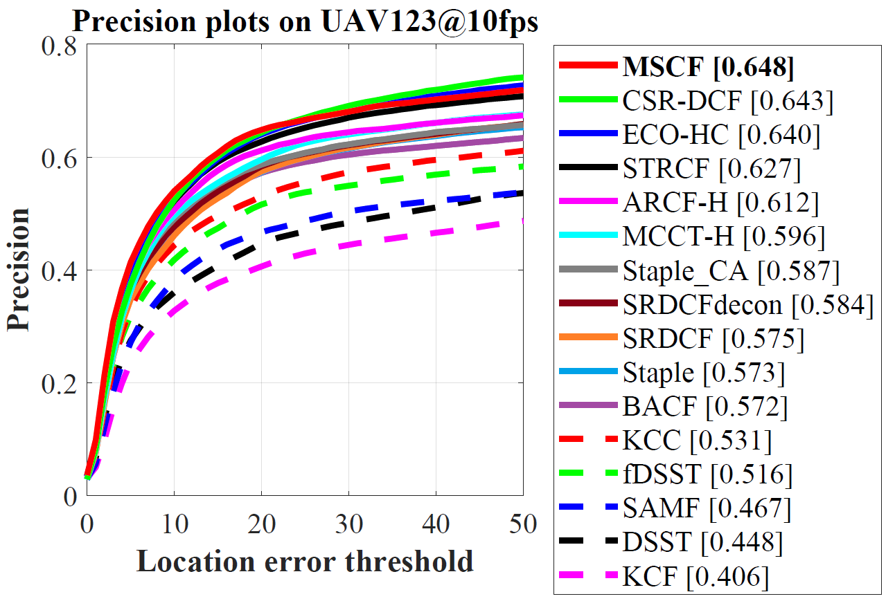
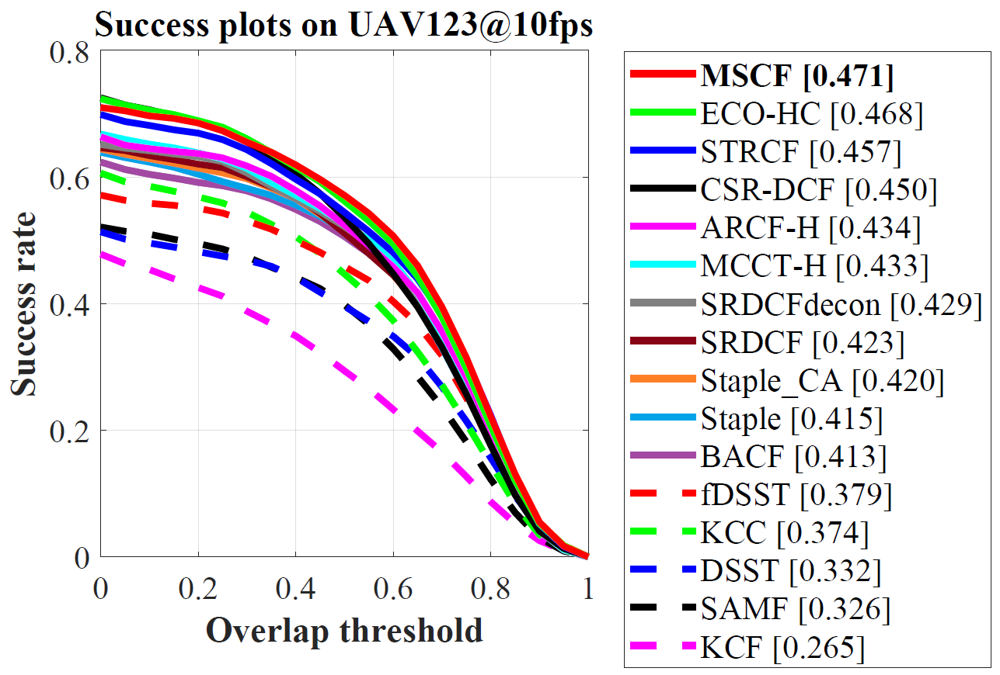
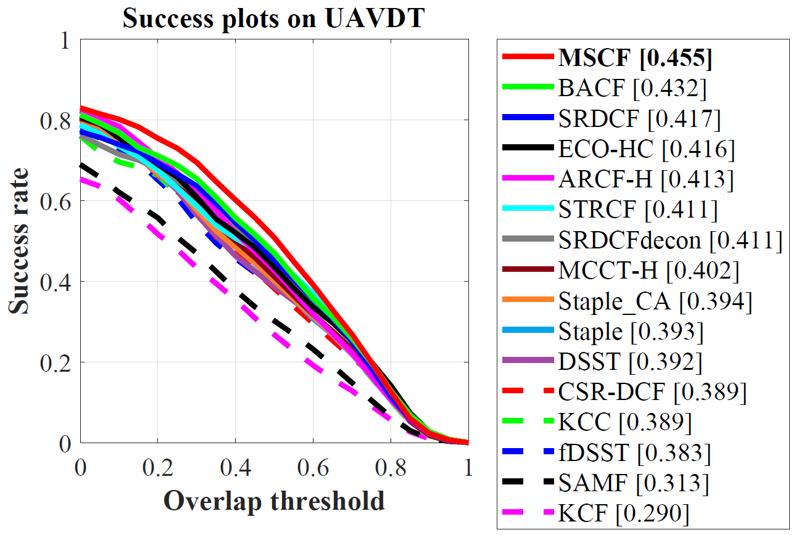
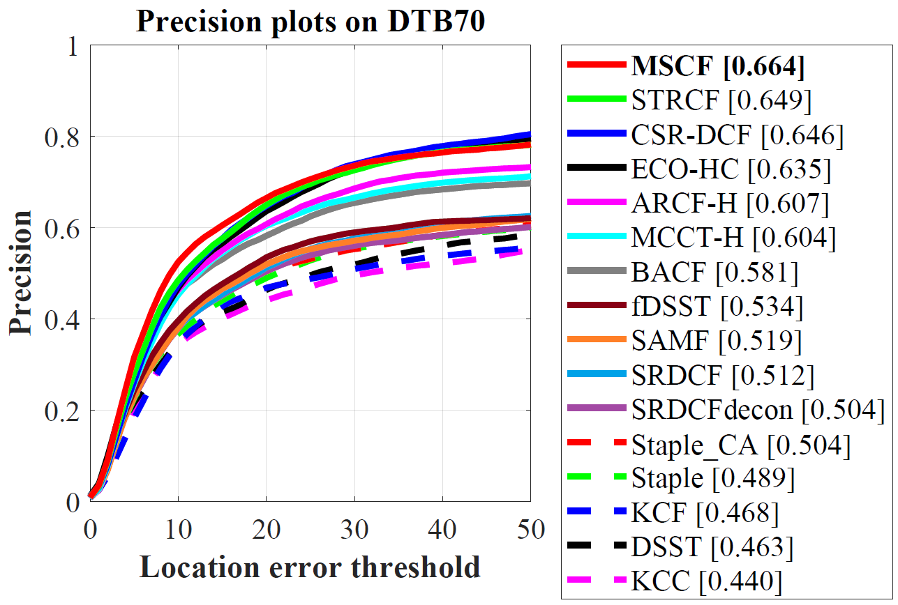
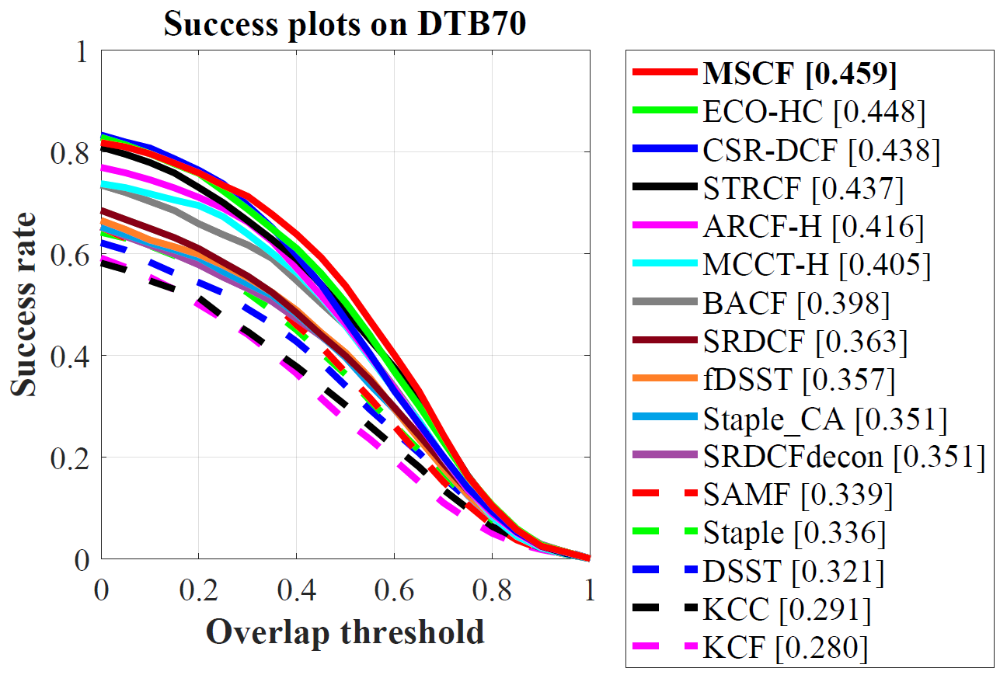

# Mutation Sensitive Correlation Filter for Real-Time UAV Tracking with

# Abstract 
>Unmanned aerial vehicle (UAV) based visual tracking has been confronted with numerous challenges, e.g., object motion and occlusion. These challenges generally bring
>about target appearance mutations and cause tracking failure. However, most prevalent discriminative correlation filter (DCF) based trackers are insensitive to target mutations due to a predefined label, which concentrates on merely the centre of the target. Meanwhile, appearance mutations incited by occlusion or similar objects commonly lead to inevitable learning of erroneous information. To cope with appearance mutations, this paper proposes a novel DCF-based method to enhance the sensitivity and resistance to mutations with an adaptive hybrid label, i.e., MSCF. The ideal label is optimized jointly with the correlation filter and remains consistent with the previous label. Meanwhile, a novel measurement of mutations called mutation threat factor (MTF) is applied to correct the label dynamically. Through the revision of label into hybrid shape, MSCF can demonstrate preferable adaptability during appearance mutations. Considerable experiments are conducted on widely used UAV benchmarks. Results manifest the performance of MSCF tracker surpassing other 26 state-ofthe- art DCF-based and deep-based trackers. With a real-time speed of 38 frames/s, the proposed approach is sufficient for UAV tracking commissions.

# Contact 
Changhong Fu

Email: changhong.fu@tongji.edu.cn

Guangze Zheng

Email: 1851960@tongji.edu.cn

# Demonstration running instructions

Running demonstration of this tracker is very easy so long as you have MATLAB. Just download the package, extract it and follow two steps:
1. Config seq name in `configSeqs_demo_for_MSCF.m`,
2. Run `MSCF_Demo_single_seq.m`,
and the MSCF Demo should be running.

>This code is compatible with UAV123 benchmark. Therefore, if you want to run it in benchmark, just put MSCF folder in `trackers`, and config sequences and trackers according to instructions from UAV123. This should also do it.

# Results on UAV datasets

## UAV123@10fps

## UAVDT

## DTB70

# Acknowledgements

We thank the contribution of `Hamed Kiani`, `Feng Li`,  `Martin Danelljan` for their previous work BACF, STRCF and ECO. The feature extraction modules are borrowed from the ECO tracker (https://github.com/martin-danelljan/ECO) and STRCF tracker (https://github.com/lifeng9472/STRCF) and some of the parameter settings and functions are borrowed from BACF (www.hamedkiani.com/bacf.html) and STRCF.

